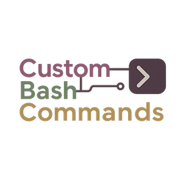

# Custom Bash Commands

Custom Bash Commands (CBC) is a personal automation toolkit for Linux shells.
It wraps interactive helpers, media utilities, fuzzy finders, and Git-focused
shortcuts around a single Bash entry point so the experience stays consistent
across machines.【F:custom_bash_commands.sh†L1-L3357】 CBC ships with a dedicated
alias catalog, a lightweight installer, and supplemental documentation that keep
new environments aligned with the toolkit's expectations.【F:cbc_aliases.sh†L1-L135】【F:install_cbc.sh†L1-L34】【F:docs/standard_operating_procedures.md†L1-L72】

- [Overview](#overview)
- [Key Components](#key-components)
- [Prerequisites](#prerequisites)
- [Installation](#installation)
- [Post-Installation Behavior](#post-installation-behavior)
- [Daily Usage](#daily-usage)
- [Supporting Docs & Utilities](#supporting-docs--utilities)
- [Troubleshooting](#troubleshooting)

## Overview

The core script detects whether [Charmbracelet gum](<https://github.com/>
charmbracelet/gum) is available before exposing a Catppuccin-themed set of
styling helpers and gracefully falling back to plain `printf` and `read` when
gum is absent.【F:custom_bash_commands.sh†L1-L129】 A startup routine creates the
Temporary, GitHub, and Grymm's Grimoires working directories, checks GitHub for
new CBC releases with cached polling rules, and prints a version dashboard so
users know which features loaded successfully.【F:custom_bash_commands.sh†L1579-L1781】【F:custom_bash_commands.sh†L1787-L1829】【F:custom_bash_commands.sh†L3220-L3342】

## Key Components

| Path | Purpose |
| --- | --- |
| `custom_bash_commands.sh` | Main entry point. Defines gum-aware UI helpers, configures onboarding tasks, implements feature functions, and triggers the initial status output when sourced.【F:custom_bash_commands.sh†L1-L3357】 |
| `cbc_aliases.sh` | Catalog of navigation shortcuts, Git aliases, fuzzy wrappers, media launchers, and helper shorthands that keep the main script modular.【F:cbc_aliases.sh†L1-L135】 |
| `install_cbc.sh` | Installer that validates the repository path, copies the main script and aliases into the home directory, and appends sourcing lines to `.bashrc` when missing before reloading the shell.【F:install_cbc.sh†L1-L34】 |
| `docs/` | Reference documentation covering dependency expectations, SOPs for adding functions or aliases, and the current TODO backlog.【F:docs/dependencies.md†L1-L24】【F:docs/standard_operating_procedures.md†L1-L72】【F:docs/todo.md†L1-L81】 |
| `CHANGELOG.md` & `cbc_logo_00001.png` | Human-readable release history and branding assets referenced by the CLI and README.【F:custom_bash_commands.sh†L1483-L1529】 |

## Prerequisites

CBC targets Arch Linux systems. Install the tools that the scripts and aliases
call directly so each helper works without manual edits. The
`docs/dependencies.md` file tracks the primary package list, while the main
script and alias catalog reference additional utilities such as Git, curl,
`bat`, `fzf`, `yt-dlp`, `wl-copy`, Obsidian, Lazygit, Zellij, and the Catppuccin
friendly `eza` file lister.【F:docs/dependencies.md†L1-L24】【F:custom_bash_commands.sh†L145-L1106】【F:cbc_aliases.sh†L11-L135】 Gum is optional but unlocks the
styled UI experience.【F:custom_bash_commands.sh†L1-L129】

## Installation

1. Ensure the canonical repository location exists:

   ```bash
   mkdir -p ~/Documents/github_repositories
   ```

2. Clone the project into the expected folder:

   ```bash
   git clone https://github.com/iop098321qwe/custom_bash_commands \
     ~/Documents/github_repositories/custom_bash_commands
   ```

3. Run the installer from inside the repository:

   ```bash
   cd ~/Documents/github_repositories/custom_bash_commands
   ./install_cbc.sh
   ```

   The script verifies the repository path, copies the main script and alias
   catalog into the home directory, appends the sourcing line to `.bashrc` when
   missing, and reloads the shell session.【F:install_cbc.sh†L1-L34】

If you install manually, copy `custom_bash_commands.sh` and `cbc_aliases.sh` to
`~` (prefixed with dots), mark them executable, and append the following to the
end of `~/.bashrc`:

```bash
source ~/.custom_bash_commands.sh
```

The main script includes an `append_to_bashrc` guard that performs the same
addition when CBC loads, so ensure only one set of sourcing lines remains in the
file.【F:custom_bash_commands.sh†L960-L1003】 Restart the shell (or run `refresh`)
when you finish so the new commands load.【F:cbc_aliases.sh†L103-L116】

## Post-Installation Behavior

When the terminal sources CBC it immediately prepares the working environment:

- `setup_directories` creates the Temporary workspace (with screenshot and
  recording subfolders), the GitHub repositories directory, and the Grymm's
  Grimoires vault if they do not already exist.【F:custom_bash_commands.sh†L1579-L1629】
- CBC does not check for updates automatically. Run `cbc update check` when you
  want to query the GitHub Releases API. The command uses `curl` with
  `--connect-timeout 10` and `--max-time 30` to avoid hangs, and it reports
  whether you are up to date or if an update is available.
  【F:custom_bash_commands.sh†L1275-L1408】
- `display_version` runs automatically once per interactive session to show the
  current version, discovery hints, and removal instructions, while
  `cbc_aliases.sh` is sourced to expose every alias. If `.bash_aliases` exists
  it is sourced as well so user-defined shortcuts remain available.
  【F:custom_bash_commands.sh†L3220-L3357】【F:cbc_aliases.sh†L1-L135】

## Daily Usage

### Discover and monitor CBC

- `display_version` (alias `dv`) prints the current version banner and links to
  the wiki for deeper documentation.【F:custom_bash_commands.sh†L1787-L1829】
- `changes [-c]` opens or copies the GitHub changelog before you update so you
  can scan release notes from the terminal.【F:custom_bash_commands.sh†L1483-L1529】
- `readme [-c]` opens or copies the GitHub README so you can review setup and
  usage details quickly.
- `wiki [-c|-C|-A|-F]` opens the project wiki or copies the URL to the
  clipboard, and it can jump to Alias Reference, Command Reference
  (commands/functions), or the Cheatsheet page.
  【F:custom_bash_commands.sh†L1413-L1477】
- `cbc list [-v]` lists every custom function and alias CBC provides. Use
  `cbc list -v` when you want descriptions alongside each entry.
  【F:custom_bash_commands.sh†L1835-L2626】

### Update CBC

- `cbc update check` queries the latest GitHub release and reports whether your
  local version is current or if a new release is available, along with the
  current and latest version numbers plus the release link.
  【F:custom_bash_commands.sh†L1275-L1408】
- `updatecbc` (alias `ucbc`) now presents a gum-styled confirmation (with a
  plain-text fallback) before performing a sparse checkout of the repository.
  It shows spinners while preparing the temporary clone, pulling the latest
  files, and overwriting `~/.custom_bash_commands.sh` and
  `~/.cbc_aliases.sh` in place. After a successful copy, the script reloads the
  updated commands automatically.【F:custom_bash_commands.sh†L2736-L2850】

### Manage CBC modules

- `cbc pkg` stores module metadata in `~/.config/cbc/packages.toml` using
  `[[module.deps]]` entries that carry `use`, `rev`, and `hash` fields so your
  installs can be synchronized across systems.
- `cbc pkg install <creator/repo|git-url|path>` records a module in the
  manifest (without removing existing entries), capturing revision details when
  possible so `cbc pkg load` can later clone it.
- `cbc pkg load` reads `packages.toml`, installs any missing modules using the
  `use` field into `~/.config/cbc/modules/`, updates the recorded `rev` and
  `hash` values, and sources each module's `cbc-module.sh` entrypoint.
- `cbc pkg uninstall <creator/repo|module-name>` prunes the entry from
  `packages.toml`, deletes the module directory in
  `~/.config/cbc/modules/`, and should be followed by a new shell session to
  clear any sourced functions.
- `cbc pkg update` performs a single fetch per module with a "Checking
  <module>" spinner, fast-forwards only when new commits are present, refreshes
  the stored metadata, shows `Updated Modules` and `Skipped Modules` headers
  with one module per line, and reloads the modules.
- `cbc pkg` or `cbc pkg list` reports manifest entries with their last updated
  date and a status that marks modules as `Current` or `UPDATE AVAILABLE`.

### Automation, media, and file utilities

- `batchopen`, `phopen`, and `phsearch` open batches of URLs or interactive
  search results in the browser while respecting gum confirmations and fzf
  selections.【F:custom_bash_commands.sh†L145-L338】
- `pronlist` integrates with `_configs.txt` and `yt-dlp` to build download
  manifests from curated text files and optional line selections.
  【F:custom_bash_commands.sh†L341-L485】
- `sopen`, `sopenexact`, and `random` launch media files that match selected
  patterns or pick a random video from the current directory.【F:custom_bash_commands.sh†L488-L1407】
- `repeat` reruns commands with optional delays and verbose logging so you can
  automate repetitive tasks safely.【F:custom_bash_commands.sh†L702-L780】
- `backup` and `makeman` provide lightweight utilities for backups and
  documentation. 【F:custom_bash_commands.sh†L2631-L3141】
- `regex_help` defaults to a PCRE cheat-sheet and can list or interactively
  display other regex flavors so the syntax you need is always in reach.
  【F:custom_bash_commands.sh†L2827-L3164】

### Aliases and navigation

Common aliases cover directory jumps (`cbc`, `cdgh`, `vault`, `temp`), Git
workflows (`cbcc`, `gco`, `gsw`, `gpfom`), fuzzy file launchers (`fo`, `fman`,
`iopen`), and media helpers (`pron`, `so`, `vopen`).【F:cbc_aliases.sh†L11-L135】
Single-letter aliases are limited to `c`, `s`, `v`, `x`, and `z` in
`cbc_aliases.sh`.【F:cbc_aliases.sh†L43-L52】
Use `cbc list -v` for descriptions whenever you need a refresher.
【F:custom_bash_commands.sh†L1835-L2626】

## Supporting Docs & Utilities

- `docs/dependencies.md` lists the baseline package set CBC expects to find on a
  workstation.【F:docs/dependencies.md†L1-L24】
- [Standard Operating Procedures](docs/standard_operating_procedures.md)
  documents the preferred structure for new functions, aliases, and manual
  testing workflows.【F:docs/standard_operating_procedures.md†L1-L118】
- `docs/todo.md` tracks outstanding cleanup and feature work, including plans to
  reorganize the `cbc list` catalog output.【F:docs/todo.md†L1-L34】

## Documentation Style

Most Markdown in this project is wrapped at 80 characters. The following cases
may exceed that limit when readability would otherwise suffer:

- Tables, including the repository orientation table in `AGENTS.md` and the Key
  Components table in this README.
- URLs that become ambiguous or unusable when broken across lines.
- Code fences where formatting depends on preserving longer lines.

## Contribution Workflow

- Work on feature branches and keep commit and PR titles in Conventional Commit
  format.
- Write PR summaries that explain motivation, user-facing behaviour changes,
  tests performed, and documentation updates (including this README and
  `AGENTS.md`). If you push new commits before merging, revise the PR body so it
  reflects every change in the current diff.

## Troubleshooting

- **Provisioning fails with a path error:** `install_cbc.sh` verifies the
  repository lives at `~/Documents/github_repositories/custom_bash_commands` and
  aborts if it does not. Move the clone into the expected location and rerun the
  script.【F:install_cbc.sh†L1-L21】
- **Dependencies missing or failing silently:** Compare your environment against
  the dependency list and confirm helpers such as `fzf`, `yt-dlp`, `wl-copy`, and
  `bat` are installed. CBC leans on these binaries in both scripts and alias
  definitions.【F:docs/dependencies.md†L1-L24】【F:custom_bash_commands.sh†L145-L1529】【F:cbc_aliases.sh†L11-L135】
